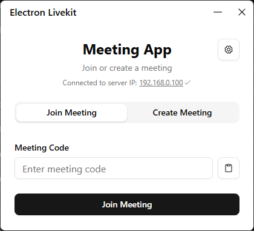
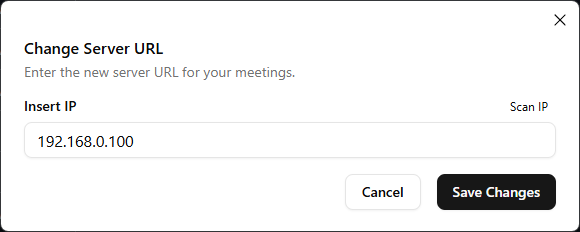
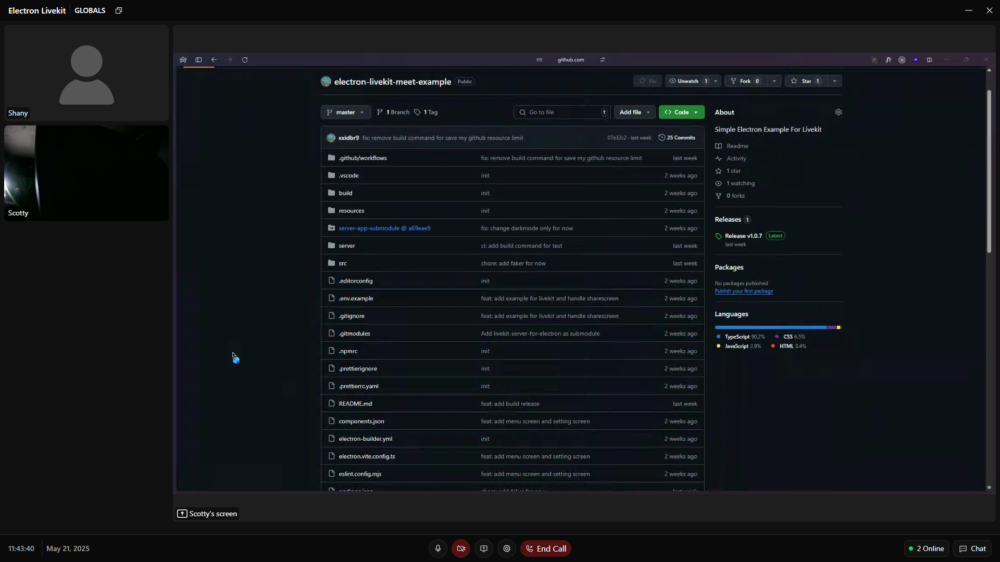
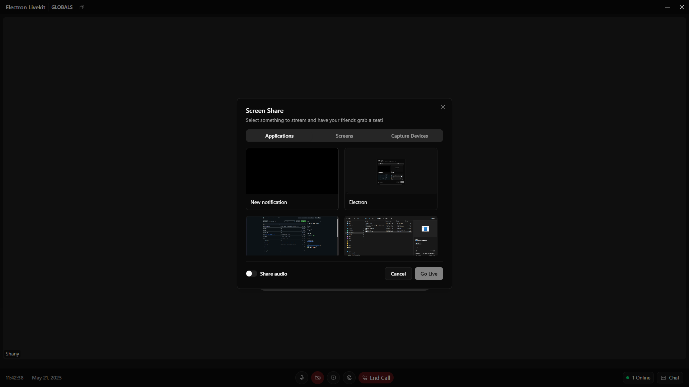

# electron-livekit-meet-app

An Electron application with React and TypeScript


## Screenshots

### Main Menu

### Settings

### Room

### Share Screen


## How to use
- [Download](#Download) and run all .exe files, make sure you have setup livekit server configuration.

## Configuration
```yaml
port: 7880
log_level: info
rtc:
  tcp_port: 7881
  port_range_start: 50000
  port_range_end: 60000
  # use_external_ip should be set to true for most cloud environments where
  # the host has a public IP address, but is not exposed to the process.
  # LiveKit will attempt to use STUN to discover the true IP, and advertise
  # that IP with its clients
  use_external_ip: false

keys:
  # key-value pairs
  # your_api_key: <your_api_secret>
  devkey: secret
# When enabled, LiveKit will expose prometheus metrics on :6789/metrics
#prometheus_port: 6789
turn:
  enabled: false
  # domain must match tls certificate
  # domain: <turn.myhost.com>
  # # defaults to 3478. If not using a load balancer, must be set to 443.
  # tls_port: 3478
```

## Download
[Download](https://github.com/xxidbr9/electron-livekit-meet-example/releases)

## Recommended IDE Setup

- [VSCode](https://code.visualstudio.com/) + [ESLint](https://marketplace.visualstudio.com/items?itemName=dbaeumer.vscode-eslint) + [Prettier](https://marketplace.visualstudio.com/items?itemName=esbenp.prettier-vscode)

## Project Setup

### Install

```bash
$ pnpm install
```

### Development

```bash
$ pnpm dev
```

### Build

```bash
# For windows
$ pnpm build:win

# For macOS
$ pnpm build:mac

# For Linux
$ pnpm build:linux
```
